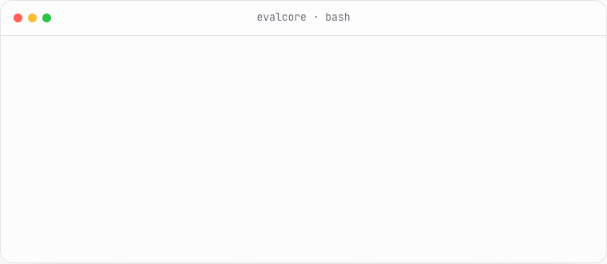

<p align="center">
  <picture>
    <source media="(prefers-color-scheme: dark)" srcset="design/assets/mark-dark-256.png">
    <source media="(prefers-color-scheme: light)" srcset="design/assets/mark-256.png">
    
  </picture>
</p>

<h1 align="center">EvalCore</h1>

<p align="center">
  <strong>Snapshot testing for AI behavior.</strong><br>
  Know when your AI gets worse, before your users do.
</p>

<p align="center">
  <a href="https://github.com/eval-core/evalcore/actions/workflows/ci.yml"></a>
  <a href="https://crates.io/crates/evalcore"></a>
  <a href="https://github.com/eval-core/evalcore/releases"></a>
  <a href="LICENSE"></a>
</p>

<p align="center">
  <a href="https://evalcore.cc/">Docs</a> ·
  <a href="https://evalcore.cc/getting-started/quickstart/">Quickstart</a> ·
  <a href="examples/">Examples</a> ·
  <a href="https://github.com/eval-core/evalcore/releases">Releases</a> ·
  <a href="CHANGELOG.md">Changelog</a>
</p>

<p align="center">
  <a href="https://www.producthunt.com/products/evalcore?embed=true&utm_source=badge-featured&utm_medium=badge&utm_campaign=badge-evalcore-2" target="_blank" rel="noopener noreferrer">
    <picture>
      <source media="(prefers-color-scheme: dark)" srcset="https://api.producthunt.com/widgets/embed-image/v1/featured.svg?post_id=1201007&theme=dark&t=1784567129943">
      <source media="(prefers-color-scheme: light)" srcset="https://api.producthunt.com/widgets/embed-image/v1/featured.svg?post_id=1201007&theme=light&t=1784567129943">
      
    </picture>
  </a>
</p>

<p align="center">
  <picture>
    <source media="(prefers-color-scheme: dark)" srcset="design/assets/readme-terminal-dark.gif">
    <source media="(prefers-color-scheme: light)" srcset="design/assets/readme-terminal.gif">
    
  </picture>
</p>

EvalCore is a single-binary eval runner for LLM applications and agents. Define
cases and scoring in YAML, run them against your system, and use the exit code to
gate a pull request.

- **No SDK lock-in.** Test shell commands, HTTP APIs, OpenAI-compatible endpoints,
  and recorded OTel or OpenInference traces.
- **Repeatable CI.** Record cacheable model, API, judge, and embedding calls once;
  replay them without network access or API keys.
- **Reviewable tests.** Cases live in JSONL, behavior lives in YAML, and accepted
  results can be saved as baselines.
- **Local by default.** No EvalCore server, account, or telemetry. Reports and run
  history stay with the project.

> **Status:** EvalCore is pre-1.0. Config and CLI details may change between minor
> releases.

## Install

With Rust installed:

```sh
cargo install evalcore --locked
```

Prebuilt binaries are available for Linux x64 and macOS on Apple Silicon or
Intel. See the [installation guide](https://evalcore.cc/getting-started/installation/)
or download one from [GitHub Releases](https://github.com/eval-core/evalcore/releases).

## Run the offline example

The repository includes a support-bot suite that needs no model, network access,
or API key:

```sh
git clone --depth 1 https://github.com/eval-core/evalcore.git
cd evalcore
evalcore run examples/quickstart/evals.yaml
```

`evalcore run` exits `0` when the suite passes and `1` when a case, gate, or
baseline check fails.

## Define a suite

An EvalCore suite has a YAML config and a JSONL dataset. This example sends each
case to a local process, checks its response, and requires at least 95% of cases
to pass:

```yaml
# evals.yaml
targets:
  support-bot:
    type: shell
    cmd: "python app.py"

datasets:
  - file: cases.jsonl

scorers:
  - type: contains
    value: "policy"
    case_sensitive: false
  - type: regex
    pattern: "policy [0-9.]+"

run:
  gates:
    - type: pass_rate
      min: 0.95
```

```jsonl
{"id":"late-refund","input":"My refund is late. What should I do?","context":["Policy 4.2: Approved refunds are processed within 30 business days."]}
{"id":"wire-eta","input":"How long does an international wire take?","context":["Policy 5.3: International wires settle within 3 to 5 business days."]}
```

Replace the shell target with your HTTP endpoint, model gateway, or agent trace.
The cases and scoring contract stay the same. Every config field is covered in
the [configuration reference](https://evalcore.cc/reference/configuration/).

## Record once, replay in CI

EvalCore stores cacheable calls in `.evalcore/cache.db`, keyed by the canonical
request. Commit that cassette with the suite and replay it on pull requests:

```sh
evalcore run evals.yaml                  # replay hits, record misses
evalcore run evals.yaml --cache replay   # cache only; a miss fails the case
evalcore run evals.yaml --cache live     # call again and replace recordings
evalcore run evals.yaml --cache off      # bypass the cache
```

Replay mode never falls through to a live request. It needs no provider key and
introduces no model variance into the pull-request check. Use a scheduled live
run to detect provider drift separately. Shell targets and imported traces are
not cached because their behavior can change without changing the request.

Read the [record/replay guide](https://evalcore.cc/guides/record-replay/) for the
cassette lifecycle and cache-key rules.

## What it covers

| Need | EvalCore surface | Guide |
|---|---|---|
| Test a CLI, service, model, or trace | `shell`, `http`, `openai-compatible`, `trace` targets | [Core concepts](https://evalcore.cc/getting-started/core-concepts/) |
| Check text, JSON, meaning, or a rubric | `contains`, `exact`, `regex`, `json-schema`, `similarity`, `judge` | [Configuration](https://evalcore.cc/reference/configuration/) |
| Bring your own scorer in any language | JSON over stdin/stdout with `subprocess` | [Custom scorers](https://evalcore.cc/guides/custom-scorers/) |
| Catch only new regressions | `--baseline` and `--save-baseline` | [Gates and baselines](https://evalcore.cc/guides/gates-and-baselines/) |
| Measure unstable outputs | repeated trials with `all`, `majority`, or `any` | [Trials and statistics](https://evalcore.cc/guides/trials-and-statistics/) |
| Compare models, prompts, or endpoints | `--matrix target-a,target-b` | [Comparing models](https://evalcore.cc/guides/comparing-models/) |
| Check agent tool use | OTel/OpenInference traces and `trajectory` rules | [Agents and traces](https://evalcore.cc/guides/agents-and-traces/) |
| Grade RAG answers against retrieved evidence | case `context` passed to scorers | [RAG evaluation](https://evalcore.cc/guides/rag-evaluation/) |
| Track tokens and enforce spend limits | target cost rates and `budget_usd` | [Cost and budgets](https://evalcore.cc/guides/cost-and-budgets/) |
| Inspect and share results | terminal, JSON, JUnit, HTML, and `evalcore serve` | [HTML reports](https://evalcore.cc/guides/html-reports/) |

## GitHub Actions

One step installs EvalCore, runs the suite, adds the terminal report to the step
summary, and uploads a self-contained HTML report even when the suite fails:

```yaml
- uses: eval-core/evalcore@v0.7.5
  with:
    config: evals/evals.yaml
    args: --cache replay --baseline main
    html-artifact: evalcore-report
```

The action returns the same `0` or `1` result as the CLI. The binary works in
other CI systems without an integration layer. See [Running in CI](https://evalcore.cc/guides/running-in-ci/)
for complete GitHub Actions, GitLab, and Jenkins examples.

## Examples

| Example | Shows | Run |
|---|---|---|
| [Quickstart](examples/quickstart/) | Offline shell target, deterministic scorers, suite gate | `evalcore run examples/quickstart/evals.yaml` |
| [Support RAG](examples/support-rag/) | Retrieved context and grounded answers | `evalcore run examples/support-rag/evals.yaml` |
| [OpenAI-compatible](examples/openai/) | Chat endpoint, usage, cost, record/replay | `evalcore run examples/openai/evals.yaml` |
| [Agent trace](examples/agent-trace/) | Native, OTel, and OpenInference traces with trajectory rules | `evalcore run examples/agent-trace/evals.yaml` |
| [Claims triage](examples/claims-triage/) | Classification metrics and quality gates | `evalcore run examples/claims-triage/evals.yaml` |

## Project principles

- **Protocols over SDKs.** Rust is the engine, not the extension interface.
- **Configuration first.** A reviewer can see the eval contract in a diff.
- **Deterministic output.** Results stay in dataset order and reporters are pure
  functions of a completed run.
- **Failures are data.** One broken target or scorer fails its case without
  aborting the rest of the suite.

## Contributing

Bug reports, feature requests, and pull requests are welcome. Start with
[CONTRIBUTING.md](CONTRIBUTING.md). Report security issues through
[SECURITY.md](SECURITY.md), not the public issue tracker.

```sh
cargo build
cargo nextest run --workspace                    # or: cargo test --workspace
cargo clippy --workspace --all-targets -- -D warnings
cargo fmt --all --check
```

EvalCore is maintained by [Abhishek Manyam](https://github.com/abhishekmanyam)
and [Kuladeep Mantri](https://github.com/kuladeepmantri).

## License

Licensed under [Apache-2.0](LICENSE).
